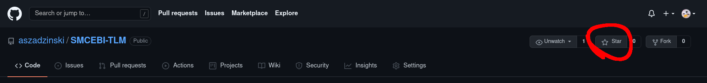

# Zajęcia 1

---

- [Podsumowanie](#Podsumowanie)
- [Warto doczytać](#Warto-doczytać)
- [Zadania](#Zadania)

---

## Podsumowanie

**Najważniejsze polecenia** [LINK](https://kinsta.com/blog/linux-commands/)

#### [SSH](https://en.wikipedia.org/wiki/Secure_Shell)

połączenie z komputerem `<adres_hosta>` jako użytkownik `<nazwa-użytkownika>`

`$: ssh nazwa-użytkownika@adres-hosta -p PORT`

generowanie kluczy ssh:

`$: ssh-keygen -b ILE_BITOW`

zapisane w `~/.ssh/id_rsa*`

#### Wejście do katalogu

`$: cd KATALOG`

skróty: `.` aktualny katalog, `~` katalog domowy, `..` katalog wyżej

#### Aktualna ścieżka

`$: pwd`

#### Pokaż pliki

`$: ls`

Najczęstsze argumenty: `-l` szczegóły, `-a` pokaż ukryte katalogi

#### Nowy katalog

`$: mkdir NAZWA_KATALOGU`

#### Kopiuj, przenieś, usuń

`$: cp CO GDZIE`

`$: mv CO GDZIE`

`$: rm PLIK_DO_USUNIĘCIA`

Najczęstsze argumenty: `-r` rekursywnie, `-f` wymuś

#### Pokaż dokumentacje

`$: man POLECENIE`

#### Szukaj

`$: find GDZIE -parametr "WYRAŻENIE"`

`-parametr`: np. `-name` nazwa pliku, `-iname` ignoruj wielkość liter itp.

#### Zmiana uprawnień

`$: chmod WŁAŚCICIEL|GRUPA|INNI PLIK`

np. `$: chmod 764 plik.txt`

`1`- wykonanie, `2` odczyt, `4` zapis

zmiana właściciela:

`$: chown KTO PLIK`

zmiana grupy:

`$: chgrp GRUPA PLIK`

#### Przykładowe edytory tekstu

`$: nano`
`$: vim #jak wyjść z vim'a: ESC :q!`

#### Pokaż zawartość pliku

`$: cat PLIK`

`$: less PLIK`

#### Strumienie

np. poszukaj "wyrażenie" w pliku file.txt

`$: cat file.txt  | grep "wyrażenie"`

#### [Przekierowania](https://stackoverflow.com/questions/818255/in-the-shell-what-does-21-mean#)

`$: ls > plik.txt`

wyjście polecenia `ls` zapisane w `plik.txt`. `>` nadpisz, `>>` dopisz

`1>` stdout, `2>` stderr

#### Uruchamianie plikow wykonywalnych

`./plik`

lub

`/ścieżka/plik`

### Kryptografia asymetryczna

[RSA](https://en.wikipedia.org/wiki/RSA_(cryptosystem)#Operation), [klucze publiczne, prywatne](https://protonmail.com/blog/what-is-pgp-encryption/)

#### Pokaż klucze publiczne

`$ gpg --list-keys`

#### Pokaż klucze publiczne

`$ gpg --list-secret-keys`

#### Wygeneruj klucze

`gpg --full-generate-key`

#### Wyeksportuj do pliku ASCII (klucze prywatne --export-secret-keys)

`gpg --export --armor ID_LUB_MAIL >> plik.asc`

---

## Warto doczytać

- [Emulator Linux'a na Androida](https://termux.com/)
- [Windows subsystem for Linux](https://www.windowscentral.com/how-install-wsl2-windows-10)
- [VirtualBox](https://www.virtualbox.org/)
- [Multiplexer terminala - TMUX](https://linuxize.com/post/getting-started-with-tmux/)
- Manager plików CLI - [ranger](https://github.com/ranger/ranger), [mc](https://www.linuxcommand.org/lc3_adv_mc.php)
- Powłoki systemu np.: [bash](https://pl.m.wikipedia.org/wiki/Bash)(domyślna dla większości dystrybucji systemów Linux), [zsh](https://en.m.wikipedia.org/wiki/Z_shell) i jej plugin [oh-my-zsh](https://github.com/ohmyzsh/ohmyzsh)

---

## Zadania

1. Załóż konto na [githubie](https://github.com/signup) *0ptk*
	- dodaj wygenerowane klucze GPG i SSH w ustawieniach swojego konta
	- dodaj gwiazdkę lub wyślij swoj nick mailowo

2. **dla chętnych**
	- naucz się obslugi managerów plików CLI np. ranger, mc. 
	- jak uruchomić okienkowy edytor plików mając dostęp do serwera tylko po SSH.

---
