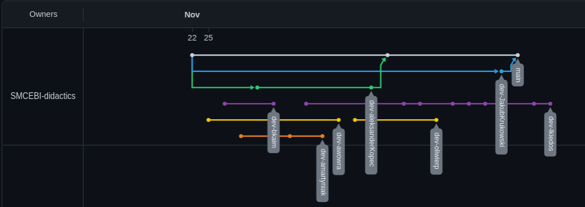

# Zajęcia 1

---

- [Podsumowanie](#Podsumowanie)
- [Zadania](#Zadania)

---

## Podsumowanie

### git: rebase

Chcąc wdrożyć zmiany z gałęzi dev do master wykonuje się:

```bash
$: git checkout master # przełącz na master
$: git merge dev # wdróż zmiany z dev do master
```

Aby zachować liniowość jak z rysunku poniżej należy użyć polecenia `rebase`:

```bash
$: git checkout dev # przełącz na gałąź dev
$: git merge master # wdraża zmiany z master do dev, może pojawić się dodatkowy commit mergujący
$: git rebase master # przebudowuje historie
$: git checkout master
$: git merge dev
```


### Jak naprawić niezagnieżdżone gałęzie (Zajęcia 4: Zadanie)



Dla gałęzi main mamy:

```
da68a0e 3 commit tag: v1.2
6a23fd9 2 commit tag: v1.1
86252d8 1 commit tag: v1.0
```

natomiast dla gałęzi dev np.:

```
ee20b33 2 dev commit tag: v1.0.1b
68fa87f 1 dev commit tag: v1.0.2b
```

brak wspólnego commitu wywoła błąd przy próbie wykonania polecenia `git merge dev`:

`fatal: refusing to merge unrelated histories`

W celu naprawy wykonujemy:

```bash
$: git checkout dev # przełącz na dev
$: git merge v1.0 --allow-unrelated-histories # wstawia brakujący commit gałęzi main
$: git push origin --force dev # opcja --force nadpisuje wadliwą gałąź w repozytorium zdalnym (należy używać ostrożnie, szczególnie w gałęzi głównej)
```
---


### Docker: Dodatkowe parametry polecenia `docker run`

- `--rm` usuń kontener po zatrzymaniu
- `--name NAZWA` ustaw nazwę dla kontenera
- `--detach` uruchom kontener w tle
- `-it` tryb interaktywny z tty (aby wyjść z powłoki bez zatrzymywania kontenera należy wcisnąć CTRL+p CTRL+q)
- 

#### Zmienne środowiskowe 

Podczas tworzenia kontenera przy pomocy `docker run` można zdefiniować zmienne środowiskowe. 

Przykładowo zbudowany obraz z Dockerfile:

```Dockerfile
FROM alpine
CMD echo "$E1 $E2"
```

w momencie tworzenia kontenera może przyjąć 2 zmienne środowiskowe `-e`:

```bash
$: sudo docker run --rm -e E1=foo -e E2=bar IMAGE
```


#### Volumeny

Współdzielić pliki w kontenerze można na 2 sposoby.

- poprzez wirtualny volumen między działającymi kontenerami,
- między maszyną matką a kontenerem.


Polecenia dla volumenów:
```bash
$: sudo docker volume ls		#wyświetla dostępne volumeny
$: sudo docker volume create NAZWA	#tworzy volumen NAZWA
# i inne inspect, prune, rm
```

Aby stworzyć 2 kontenery CON1 i CON2 posiadające wspólny wolumen MYVOL oraz w obydwu przypadkach zamontowany w katalogu /data/ wykonujemy:

```bash
$: sudo docker volume create MYVOL
$: sudo docker run -v MYVOL:/data --name CON1 IMAGE
$: sudo docker run -v MYVOL:/data --name CON2 IMAGE
```

Pliki będą widoczne w obydwu kontenerach oraz nie znikną po ich usunięciu.

Aby współdzielić z kontenerem lokalny folder `~/shared/` wykonujemy:

```bash
$: sudo docker run -v /home/user/shared/:/data/ --name CON3 IMAGE #folder zamontowany w /data
```

#### Sieci

Tworzenie każdego kontenera wiąże się z połączeniem go do domyślnej sieci `bridge`. Tak jak w przypadku volumenów, do zarządzania sieciami używamy poleceń:


```bash
$: sudo docker network ls #wyświetla dostępne sieci
$: sudo docker network create # tworzy nową sieć
# inne connect, disconnect, inspect, prune, rm
```

Dwa kontenery stworzone przez:

```bash
$: sudo docker run --rm --name APP1 --detach alpine
$: sudo docker run --rm --name APP2 --detach alpine
```

znajdują się w tej samej sieci np 172.18.0.0. Możemy do zweryfikować przez pingowanie APP2:

```bash
$: sudo docker exec APP2 ip addr # sprawdzamy adres APP2
$: sudo docker exec APP1 ping 172.18... #ping z APP1 - APP2
```

> polecenie `docker exec KONTENER polecenie` umożliwia wykonanie polecenia przez działający w tle kontener. Przydatnym jest również `docker attach` pozwalający na przywołanie z tła powłoki działającego kontenera.

Po stworzeniu kolejnych kontenerów APP3 APP4 i sieci MYNET przez:

```bash
$: sudo docker network create MYNET
$: sudo docker run --rm --name APP3 --detach  --network MYNET alpine
$: sudo docker run --rm --name APP4 --detach --network MYNET alpine
```

Podłączamy je do sieci MYNET np.172.19.0.0. Kontenery nie używają już domyślnej sieci BRIDGE wiec komunikacja może odbywać się pomiędzy APP1-APP2 oraz APP3-APP4.

Chcąc podłączyć APP1 z Bridge do kolejnej sieci MYNET, wpisujemy:

```bash
$: sudo docker network connect MYNET APP1 #  kontener APP1 znajduje się w dwóch sieciach mogąc komunikować się z pozostałymi 3 kontenerami
```

### Registry

Aby móc wypchnąć nasz obraz do zdalnego huba należy wykorzystać `docker login` celem uwierzytelnienia. Zbudowane obrazy można wypchnąć przez:

```bash
$: sudo docker tag local-image:tagname alias/new-repo:tagname # tagowanie obrazu
$: sudo docker push alias/new-repo:tagname 
```
Forma aliasu do repo może zależeć od registry.

Pobranie obrazu odbywa się przez:

```bash
$: sudo docker pull alias/repo:tagname 
```


## Zadania

VyB0eW0gdHlnb2RuaXUgYnJhayA=

---
