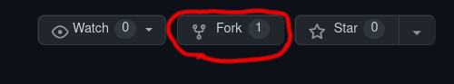

# Zajęcia 7

---

- [Zadania](#Zadania)

---

## Zadania 1ptk

#### materiały 

- [Struktura modułów Python](https://docs.python.org/3/tutorial/modules.html)
- [setuptools](https://www.youtube.com/watch?v=GaWs-LenLYE)
- [Docstring](https://www.programiz.com/python-programming/docstrings)
- [PYPI](https://pypi.org/)
- [Virtualenv](https://pythonbasics.org/virtualenv/)


1. Użyj opcji **fork** (github) na [repozytorium](https://github.com/SMCEBI-didactics/WebApp).

2. W ramach własnego forkowanego repozytorium wyodrębnij i przełącz się na **gałąź dev**.
3. Dla aplikacji **Verify** oraz **WebApp** stwórz opisy każdej funkcji (co robi, co przyjmuje, co zwraca) jako python **DocString** w preferowanym przez siebie formacie.
4. Zatwierdź zmiany w gałęzi **dev**.
5. Przełącz się na **gałąź główną main**.
6. W katalogu repozytorium (tam gdzie foldery WebApp i Verify) **wykonaj polecenie:**
```console
user@host:~$ gen-dc #generuje plik Dockerfile
```
7. Zmodyfikuj wygenerowany **Dockerfile**, aby uruchamiał aplikację **WebApp** (przeczytaj **README.md**) i zbuduj ją na **INF-VM** pod nazwą **z7-TWÓJLOGIN:1.0**
  - aplikacja powinna uruchamiać się prawidłowo dla:
 ```console
 user@host:~$ sudo docker run z7-TWÓJLOGIN:1.0
 #oraz np.
 user@host:~$ sudo docker run -e FLASK_ENV=deve... z7-TWÓJLOGIN:1.0 -h 0.0.0.0 -p 80X8 # 80X8 oznacza twój publiczny port 
 ```
8. Zatwierdź zmiany w gałęzi **main**.
9. Wróć do gałęzi **dev**.
11. Zmodyfikuj  plik **docker-compose.yml** (adminer(port 81X8) + mariadb) w celu dodania trzeciego kontenera bazującego na twoim obrazie **z7-TWÓJLOGIN**. Ustaw zmienne środowiskowe i porty, aby pomyślnie nasłuchiwał na przydzielonym ci publicznym porcie (**80X8**). Użyj zmiennych środowiskowych `FLASK_RUN_HOST=0.0.0.0`, `FLASK_RUN_PORT=80X8`, `FLASK_ENV=development`
12. **Zatwierdź** zmiany i **wypchnij** gałąź do zdalnego repozytorium.
13. Wykonaj **merge** z gałęzi **dev** do **main** (Użyj funkcji **rebase**, aby zmienić kolejność commitów), **wypchnij** zmiany do zdalnego repozytorium wraz z tagiem **v1.0-TWÓJLOGIN**.
14. Z gałęzi **main** wyodrębnij i przełącz się na branch **dev-verify**.
15. Uzupełnij braki w pliku **setup.py** w aplikacji **Verify**.
16. **Zatwierdź** zmiany.
17. W katalogu aplikacji stwórz **wirtualne środowisko** dla interpretera python:
```console
user@host:~$ virtualenv venv #pojawia się folder venv 
#aktywacja środowiska
user@host:~$ source venv/bin/activate
#dezaktywacja
(venv) user@host:~$ deactivate
```
18. **Aktywuj** środowisko.
19. W wirtualnym środowisku zainstaluj wszystkie zależności programu **Verify**(program **pip**)
20. Wykonaj **polecenie** `(venv) user@host:~$ pip freeze > requirements.txt` w katalogu *Verify* (nadpisz istniejący requirements.txt).
21. Zainstaluj moduł przy użyciu **setuptools** `python3 setup install`. 
22. Spraw aby folder **venv** oraz wygenerowane przy instalacji dodatkowe katalogi (**pycache, dist, build, eggs itp.**) nie były włączane do commita.
22. W pliku `output.txt` zapisz **sól** oraz **hash** zwracany przez  **Verify** dla wejściowej zmiennej **TWÓJLOGIN** (użyj polecenia `verify` i przekierowania do pliku lub napisz skrypt `test.py` wywołujący funkcję i zapisujący do pliku).
23. Dezaktywuj wirtualne środowisko, **zatwierdź i wypchnij** zmiany do zdalnego repozytorium.
24. Wykonaj **merge** z **dev-verify** do **main** i wypchnij zmiany do zdalnego repozytorium wraz z tagiem *v1.1-TWÓJLOGIN*. 
25. Wykonaj **pull request** w źródłowym [repozytorium](https://github.com/SMCEBI-didactics/WebApp) używając swojego forka (**nie merguj**).


 
 > Po zalogowaniu na **INF-VM** wyświetlone zostają 2 porty użytkownika: **80X8** oraz **81X8** (*X - numer uniwersalny dla każdego użytkownika*). Porty widoczne są w sieci **UŚ** pod adresem komputera **INF-VM**. Dodatkowo port **80X8** ma ustawione publiczne **reverse proxy** na port 80 (usługi http postawione na porcie **80X8** widoczne są w internecie pod adresem **studX.fenu-experiment.pl**). Aktualizacja zawartości strony przebiega z opóżnieniem (przyśpieszenie po ustawieniu **DNS** na **1.1.1.1** lub **DoH** na serwery **CloudFlare**).  
 
---
